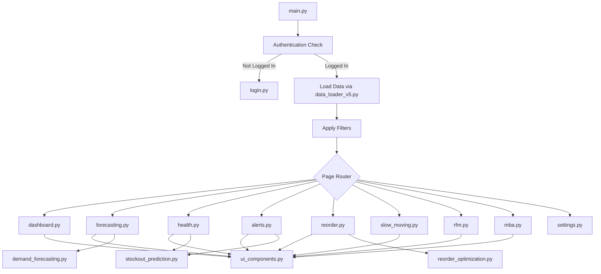

# 📊 Project Overview: Arsitektur Saat Ini

> **Tujuan**: Memahami struktur project Streamlit yang akan dimigrasikan

---

## 🗂️ Struktur Project Saat Ini

```
WPT-Project1-Folder/
├── 📄 main.py                 # Entry point utama (250 lines)
├── 📄 app.py                  # Legacy app (3330 lines) - tidak dipakai
│
├── 📁 modules/
│   ├── 📁 pages/              # 10 Halaman Streamlit
│   │   ├── dashboard.py       # Dashboard Overview (1023 lines)
│   │   ├── forecasting.py     # Demand Forecasting (11KB)
│   │   ├── health.py          # Inventory Health (10KB)
│   │   ├── alerts.py          # Stockout Alerts (8KB)
│   │   ├── reorder.py         # Reorder Optimization (7KB)
│   │   ├── slow_moving.py     # Slow-Moving Analysis (11KB)
│   │   ├── rfm.py             # RFM Analysis (23KB)
│   │   ├── mba.py             # Market Basket Analysis (34KB)
│   │   ├── settings.py        # Settings Page (21KB)
│   │   └── login.py           # Login Page (25KB)
│   │
│   ├── 📄 auth.py             # Authentication logic
│   ├── 📄 database.py         # Database operations
│   ├── 📄 data_loader_v5.py   # Data loading service (18KB)
│   ├── 📄 ui_components.py    # Reusable UI components (25KB)
│   ├── 📄 ml_pipeline.py      # ML model pipeline (86KB)
│   ├── 📄 demand_forecasting.py
│   ├── 📄 stockout_prediction.py
│   ├── 📄 reorder_optimization.py
│   └── 📄 email_utils.py
│
├── 📁 data/
│   ├── features/              # Feature engineered data
│   ├── forecasts/             # Forecast outputs
│   ├── predictions/           # ML predictions
│   └── processed/             # Processed data
│
└── 📁 config/
    └── constants.py           # Constants & configurations
```

---

## 🔄 Alur Data (Data Flow)



---

## 📦 Komponen Utama yang Akan Dimigrasikan

### 1. Authentication (`modules/auth.py`)
```python
# Fungsi-fungsi yang perlu dimigrasikan:
- is_authenticated()    → JWT verification middleware
- login(username, pwd)  → POST /api/auth/login
- logout()              → POST /api/auth/logout
- is_admin()            → Role-based middleware
```

### 2. Data Loader (`modules/data_loader_v5.py`)
```python
# Class yang perlu dimigrasikan:
- DashboardDataLoaderV5
  - load_all_data()     → GET /api/data/all
  - apply_filters()     → Query parameters
```

### 3. UI Components (`modules/ui_components.py`)
```python
# Komponen yang perlu di-convert ke React:
- render_metric_card()    → <MetricCard />
- render_alert_box()      → <AlertBox />
- render_filter_row()     → <FilterRow />
- render_data_table()     → <DataTable />
- render_sidebar_header() → <Sidebar />
- apply_page_css()        → globals.css + TailwindCSS
```

### 4. Page Modules (10 Pages)
| Streamlit Page | React Page | API Endpoint |
|----------------|------------|--------------|
| `dashboard.py` | `pages/dashboard.tsx` | `GET /api/dashboard` |
| `forecasting.py` | `pages/forecasting.tsx` | `GET /api/forecasting` |
| `health.py` | `pages/health.tsx` | `GET /api/health` |
| `alerts.py` | `pages/alerts.tsx` | `GET /api/alerts` |
| `reorder.py` | `pages/reorder.tsx` | `GET /api/reorder` |
| `slow_moving.py` | `pages/slow-moving.tsx` | `GET /api/slow-moving` |
| `rfm.py` | `pages/rfm.tsx` | `GET /api/rfm` |
| `mba.py` | `pages/mba.tsx` | `GET /api/mba` |
| `settings.py` | `pages/settings.tsx` | `GET/POST /api/settings` |
| `login.py` | `pages/login.tsx` | `POST /api/auth/login` |

---

## 🎨 Streamlit-Specific Code (Perlu Diubah)

Berikut pattern Streamlit yang **TIDAK** bisa langsung dipakai di Flask/React:

### Session State → React State
```python
# ❌ Streamlit (Sebelum)
st.session_state.selected_groups = []
if 'activities' not in st.session_state:
    st.session_state.activities = []

# ✅ React (Sesudah)
const [selectedGroups, setSelectedGroups] = useState([])
const [activities, setActivities] = useState([])
```

### Caching → API Response Caching
```python
# ❌ Streamlit (Sebelum)
@st.cache_data(ttl=3600)
def load_data():
    return pd.read_csv('data.csv')

# ✅ Flask (Sesudah)
from flask_caching import Cache
cache = Cache(config={'CACHE_TYPE': 'simple'})

@cache.cached(timeout=3600)
def load_data():
    return pd.read_csv('data.csv')
```

### Widget Callbacks → Event Handlers
```python
# ❌ Streamlit (Sebelum)
if st.button("Refresh"):
    st.cache_data.clear()
    st.rerun()

# ✅ React (Sesudah)
const handleRefresh = async () => {
    await fetch('/api/cache/clear', { method: 'POST' })
    window.location.reload()
}
<button onClick={handleRefresh}>Refresh</button>
```

---

## 📊 Dependencies yang Tetap Dipakai

Berikut library Python yang **TETAP** dipakai di Flask backend:

| Library | Fungsi | Status |
|---------|--------|--------|
| `pandas` | Data manipulation | ✅ Tetap |
| `numpy` | Numerical computing | ✅ Tetap |
| `plotly` | Charting (via JSON) | ✅ Tetap |
| `scikit-learn` | ML models | ✅ Tetap |
| `sqlalchemy` | Database ORM | ✅ Tetap |

---

## ⏭️ Langkah Selanjutnya

Lanjut ke **[02_FLASK_API_SETUP.md](./02_FLASK_API_SETUP.md)** untuk mulai setup project Flask.
